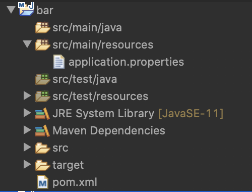

# Panache Entities Reveng Maven Plugin

## Introduction

This [Maven](http://maven.apache.org/) plugin allows you to generate Panache entities from an existing databaase.

## Build the plugin

If you want to try out this plugin, you will need to build it first as it is not yet published. You can do this in a simple way by first cloning this repository: Issue `git clone https://github.com/koentsje/quarkus-trials`.in your favorite command line tool.

```
foo@bar ~ % git clone https://github.com/koentsje/quarkus-trials
Cloning into 'quarkus-trials'...
remote: Enumerating objects: 102, done.
remote: Counting objects: 100% (102/102), done.
remote: Compressing objects: 100% (53/53), done.
remote: Total 102 (delta 15), reused 95 (delta 10), pack-reused 0
Receiving objects: 100% (102/102), 79.20 KiB | 33.00 KiB/s, done.
Resolving deltas: 100% (15/15), done.
foo@bar ~ %
```

Then you change the directory to the root folder of the plugin project:  

```
<?xml version="1.0"?>
<project xsi:schemaLocation="http://maven.apache.org/POM/4.0.0 https://maven.apache.org/xsd/maven-4.0.0.xsd" xmlns="http://maven.apache.org/POM/4.0.0"
    xmlns:xsi="http://www.w3.org/2001/XMLSchema-instance">
  <modelVersion>4.0.0</modelVersion>
  <groupId>org.foo</groupId>
  <artifactId>bar</artifactId>
  <version>0.0.1-SNAPSHOT</version>
  <dependencyManagement>
    <dependencies>
      <dependency>
        <groupId>io.quarkus</groupId>
        <artifactId>quarkus-bom</artifactId>
        <version>1.3.1.Final</version>
        <type>pom</type>
        <scope>import</scope>
      </dependency>
    </dependencies>
  </dependencyManagement>
  <dependencies>
    <dependency>
      <groupId>io.quarkus</groupId>
      <artifactId>quarkus-hibernate-orm-panache</artifactId>
    </dependency>
    <dependency>
      <groupId>io.quarkus</groupId>
      <artifactId>quarkus-jdbc-h2</artifactId>
    </dependency>
  </dependencies>
  <build>
    <plugins>
      <plugin>
        <groupId>org.codehaus.mojo</groupId>
        <artifactId>sql-maven-plugin</artifactId>
        <version>1.5</version>
        <executions>
          <execution>
            <id>create-database</id>
            <phase>initialize</phase>
            <goals>
              <goal>execute</goal>
            </goals>
            <configuration>
              <driver>org.h2.Driver</driver>
              <url>jdbc:h2:./target/database/DB</url>
              <username>sa</username>
              <password></password>
              <sqlCommand>create table foo (id int not null primary key, baz varchar(256))</sqlCommand>
            </configuration>
          </execution>
        </executions>
        <dependencies>
          <dependency>
            <groupId>com.h2database</groupId>
            <artifactId>h2</artifactId>
            <version>1.4.200</version>
          </dependency>
        </dependencies>
      </plugin>
      <plugin>
        <groupId>io.quarkus</groupId>
        <artifactId>panache-maven-plugin</artifactId>
        <version>999-SNAPSHOT</version>
        <executions>
          <execution>
            <id>Generate Entities</id>
            <phase>generate-sources</phase>
            <goals>
              <goal>generate-panache-entities</goal>
            </goals>
          </execution>
        </executions>
      </plugin>
    </plugins>
  </build>
</project>
```
As you can see in the `<build>` section, we use the `sql-maven-plugin` to create a simple database during the `initialize` phase. If you start from an existing database, you can omit this section.
The `panache-maven-plugin` gets its connection properties by default from the `application.properties` file of your application so that you don't have to specify them explicitly in your `pom.xml` file. The `application.properties` file that we are using is shown below:  

```
# datasource configuration
quarkus.datasource.url = jdbc:h2:./target/database/DB
quarkus.datasource.driver = org.h2.Driver
quarkus.datasource.username = sa
quarkus.datasource.password = 
```

As you know this file resides by default in the `src/main/resources` folder of your project. An example layout of your project is shown in the image below.



Issuing `mvn clean generate-sources` will generate the file `Foo.java`. The default generation folder is `target/generatedClasses` and the default package name is the concatenation of the groupId and the artifactId of your Maven application (in this case `org.foo.bar`). The generated file is shown below:

```
package org.foo.bar;
// Generated 6-apr-2020 12:57:31 by Hibernate Tools 5.4.13.Final

import javax.persistence.Column;
import javax.persistence.Entity;
import javax.persistence.Id;
import javax.persistence.Table;

import io.quarkus.hibernate.orm.panache.PanacheEntityBase;

/**
 * Foo generated by generate-panache-entities
 */
@Entity
@Table(name="FOO",schema="PUBLIC",catalog="DB")
public class Foo extends PanacheBaseEntity {

    @Id 
    @Column(name="ID", unique=true, nullable=false)
    public int id;
     
    @Column(name="BAZ", length=256)
    public String baz;

    public Foo() {
    }
	
    public Foo(int id) {
        this.id = id;
    }
    public Foo(int id, String baz) {
       this.id = id;
       this.baz = baz;
    }

}
```

The generation is controlled by default templates.

## Fine Tuning the Generation

It is very well possible that you are not happy with the defaults that are being used during this generation process. To overcome this problem, we offer a number of configuration and customization options.

### Using the Maven configuration

### Overriding the Reverse Engineering

### Customizing the generation templates 

