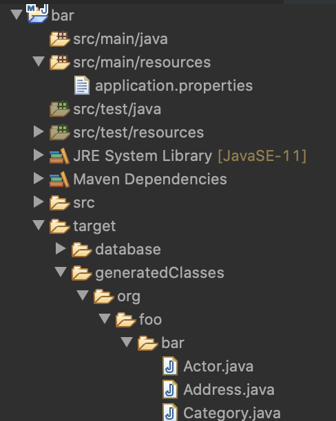

# Panache Entities Reveng Maven Plugin

## Introduction

This [Maven](http://maven.apache.org/) plugin allows you to generate Panache entities from an existing databaase.

## Build the Plugin

If you want to try out this plugin, you will need to build it first as it is not yet published. You can do this in a simple way by first cloning this repository: Issue `git clone https://github.com/koentsje/quarkus-trials`.in your favorite command line tool.

```
foo@bar ~ % git clone https://github.com/koentsje/quarkus-trials
Cloning into 'quarkus-trials'...
remote: Enumerating objects: 102, done.
remote: Counting objects: 100% (102/102), done.
remote: Compressing objects: 100% (53/53), done.
remote: Total 102 (delta 15), reused 95 (delta 10), pack-reused 0
Receiving objects: 100% (102/102), 79.20 KiB | 33.00 KiB/s, done.
Resolving deltas: 100% (15/15), done.
foo@bar ~ %
```

Then you change the directory to the root folder of the plugin project: `cd quarkus-trials/panache-reveng-plugin`  

```
foo@bar ~ % cd quarkus-trials/panache-reveng-plugin
foo@bar panache-reveng-plugin %
```

Now you are ready to build the plugin. Issuing `mvn clean insttall` will start the build and when finished install the built plugin into your local Maven repository.

```
foo@bar panache-reveng-plugin % mvn clean install
[INFO] Scanning for projects...
[INFO] 
[INFO] ------------------< io.quarkus:panache-maven-plugin >-------------------
[INFO] Building Quarkus - Panache Maven Plugin 999-SNAPSHOT
[INFO] ----------------------------[ maven-plugin ]----------------------------
...
[INFO] ------------------------------------------------------------------------
[INFO] BUILD SUCCESS
[INFO] ------------------------------------------------------------------------
[INFO] Total time:  21.992 s
[INFO] Finished at: 2020-04-08T11:07:52+02:00
[INFO] ------------------------------------------------------------------------
foo@bar panache-reveng-plugin % 
```

Now you are ready to use the plugin in your Quarkus project.

## Choose the Database

To reverse engineer entities from a database we need of course an existing database. In order not to have to start from scratch and create one, we will use the [H2 port of the Sakila database](https://github.com/maxandersen/sakila-h2). Start by cloning this repository by issuing `git clone https://github.com/maxandersen/sakila-h2` in your favourite command line tool.

```
foo@bar ~ % git clone https://github.com/maxandersen/sakila-h2
Cloning into 'sakila-h2'...
remote: Enumerating objects: 29, done.
remote: Total 29 (delta 0), reused 0 (delta 0), pack-reused 29
Unpacking objects: 100% (29/29), done.
foo@bar ~ %
```

Change the directory by navigating into the sakila-h2 folder and start the database by issuing `cd sakila-h2` and `./runh2.sh` respectively.

```
koen@Velouria ~ % cd sakila-h2 
koen@Velouria sakila-h2 % ./runh2.sh 
Starting h2 server - jdbc url: jdbc:h2:tcp://localhost/./sakila
TCP server running at tcp://localhost:9092 (only local connections)
Web Console server running at http://localhost:8082 (only local connections)
```

Congratulations! The database is ready and running. We will use the URL `jdbc:h2:tcp://localhost/./sakila` to connect to it from our panache quarkus application.

## Create an Empty Quarkus Application

Use your favourite IDE or a command line tool to create a Maven project. Use the following pom.xml.

```
<?xml version="1.0"?>
<project 
    xsi:schemaLocation="http://maven.apache.org/POM/4.0.0 https://maven.apache.org/xsd/maven-4.0.0.xsd"
    xmlns="http://maven.apache.org/POM/4.0.0"
    xmlns:xsi="http://www.w3.org/2001/XMLSchema-instance">
    
  <modelVersion>4.0.0</modelVersion>
  <groupId>org.foo</groupId>
  <artifactId>bar</artifactId>
  <version>0.0.1-SNAPSHOT</version>
  
  <dependencyManagement>
    <dependencies>
      <dependency>
        <groupId>io.quarkus</groupId>
        <artifactId>quarkus-bom</artifactId>
        <version>1.3.1.Final</version>
        <type>pom</type>
        <scope>import</scope>
      </dependency>
    </dependencies>
  </dependencyManagement>
  
  <dependencies>
    <dependency>
      <groupId>io.quarkus</groupId>
      <artifactId>quarkus-hibernate-orm-panache</artifactId>
    </dependency>
    <dependency>
      <groupId>io.quarkus</groupId>
      <artifactId>quarkus-jdbc-h2</artifactId>
    </dependency>
  </dependencies>
  
</project>
```

As you can see our sample project imports the quarkus bom and depends on two quarkus extensions: `quarkus-hibernate-orm-panache` and `quarkus-jdbc-h2`. 

## Add Some Properties

Now that we have defined our `pom.xml` file, we are ready to add some properties. Create a `application.properties` file in the `src/main/resources` folder of your project in which you define the following properties:

```
# datasource configuration
quarkus.datasource.url = jdbc:h2:tcp://localhost/./sakila
quarkus.datasource.driver = org.h2.Driver
quarkus.datasource.username = sa
quarkus.datasource.password = 
```

These properties are self explanatory: we use the database URL that was mentioned earlier as well as the H2 database driver and the default H2 credentials.

## Entity Generation

To actually perform the entity generation we need to add the `panache-maven-plugin` in the build section of our `pom.xml`. You can modify the `pom.xml` as follows:

```
<?xml version="1.0"?>
<project 
...
  <build>
    <plugins>
      <plugin>
        <groupId>io.quarkus</groupId>
        <artifactId>panache-maven-plugin</artifactId>
        <version>999-SNAPSHOT</version>
        <executions>
          <execution>
            <id>Generate Entities</id>
            <phase>generate-sources</phase>
            <goals>
              <goal>generate-panache-entities</goal>
            </goals>
          </execution>
        </executions>
      </plugin>
    </plugins>
  </build>
  
</project>
```

Once you added this section, you can issue `mvn clean generate-sources` to start the generation.

```
foo@bar bar % mvn clean generate-sources
[INFO] Scanning for projects...
[INFO] 
[INFO] ----------------------------< org.foo:bar >-----------------------------
[INFO] Building bar 0.0.1-SNAPSHOT
 ...
 INFO: HHH000400: Using dialect: org.hibernate.dialect.H2Dialect
[INFO] ------------------------------------------------------------------------
[INFO] BUILD SUCCESS
[INFO] ------------------------------------------------------------------------
[INFO] Total time:  5.829 s
[INFO] Finished at: 2020-04-08T17:14:25+02:00
[INFO] ------------------------------------------------------------------------
foo@bar bar % 
```

The default folder in which the entities are generated is `target/generatedClasses`. The package in which the entities are generated is by default the concatenation of the Maven groupId and the artifactId (in this case `org.foo.bar`).



Congratulations! You just generated your first panache entities.

## Fine Tuning the Generation

It is very well possible that you are not happy with the defaults that are being used during this generation process. To overcome this problem, we offer a number of configuration and customization options.

### Using the Maven configuration

TBD 

### Overriding the Reverse Engineering

TBD

### Customizing the generation templates 

TBD

